# My_website

Ce dépôt contient les instructions de construction de mon portfolio personnel.

## Arborescence du projet

.
├── docs/
│ ├── images/
│ ├── Home.md
│ ├── Experience.md
│ ├── Project.md
│ ├── About.md
│ ├── Contact.md
│ ├── Tools.md
│ └── CV-M2R.pdf
├── public/
└── README.md

---

## 🏠 Page d’accueil – `Home.md`

Cette page me présente en tant qu'étudiant en dernière année de master de recherche, passionné par le machine learning et à la recherche :
- d’un stage de fin d’études (M2),
- ou d’un sujet de thèse (PhD).

**Instructions :**
- Inspires-toi de cette image :  
  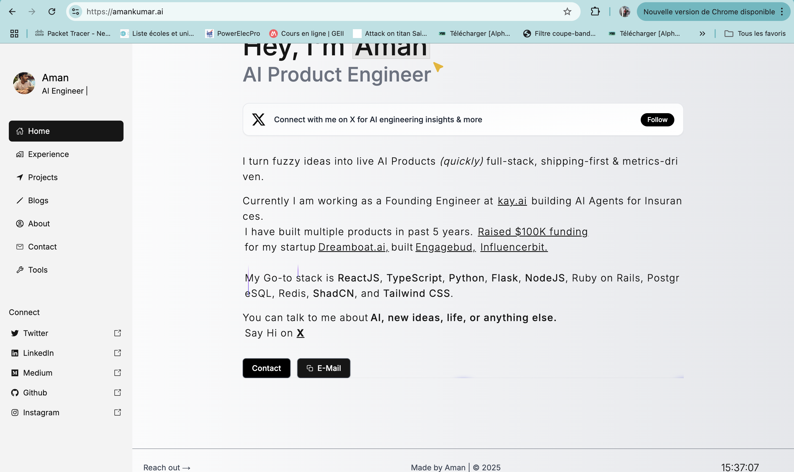
- Mon CV contient les informations à inclure pour me présenter.
- Ne cherche pas à reproduire les effets visuels compliqués, mais respecte au mieux la **structure** de la page.

---

## 🧪 Page Expérience – `Experience.md`

Cette page présente mes expériences académiques et professionnelles.

**Instructions :**
- Inspires-toi des images suivantes :
  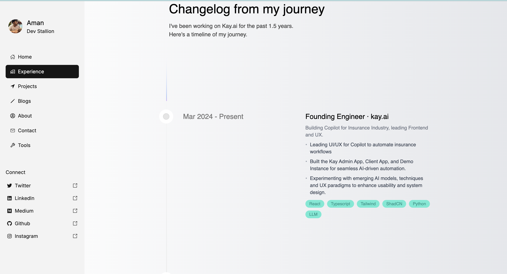
  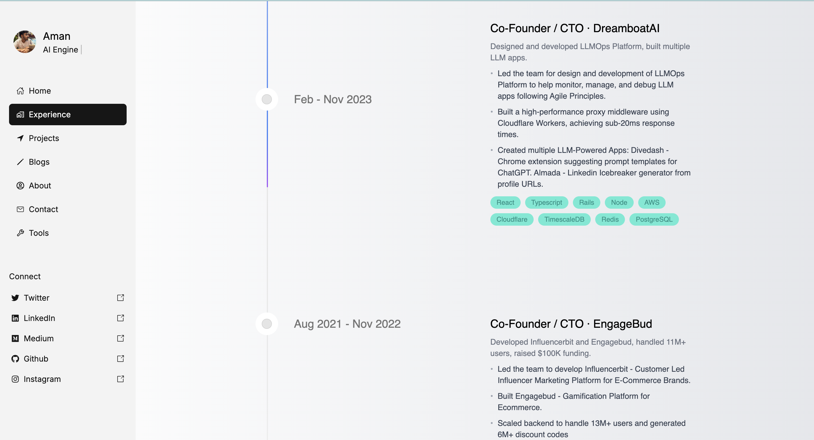
  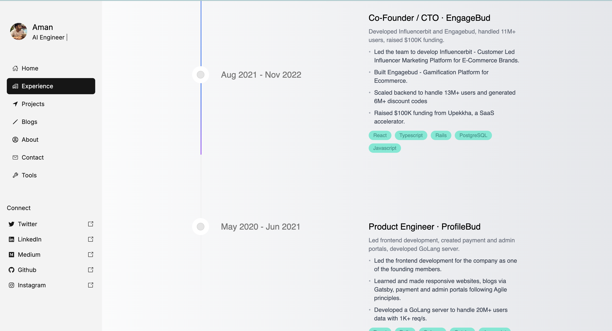
  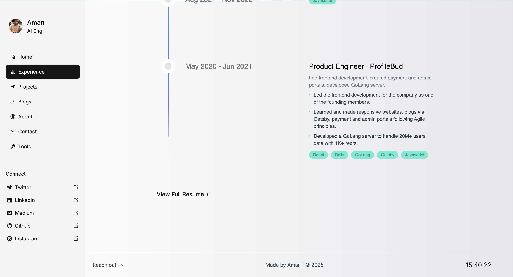
- Les expériences à intégrer sont disponibles dans mon CV.
- Garde la structure générale, sans te soucier dans un premier temps des animations ou effets visuels.

---

## 💼 Page Projets – `Project.md`

Il s'agit de la page **la plus importante** du site. Elle présente une sélection de mes projets.

**Instructions :**
- Inspires-toi des images suivantes :
  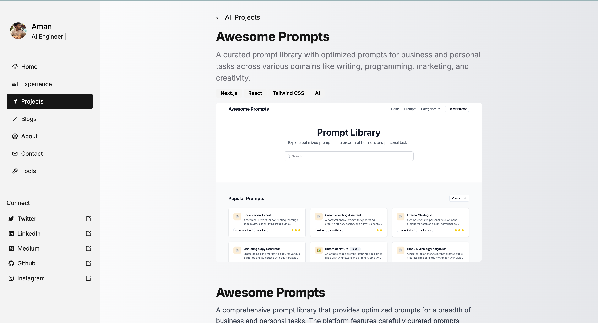
  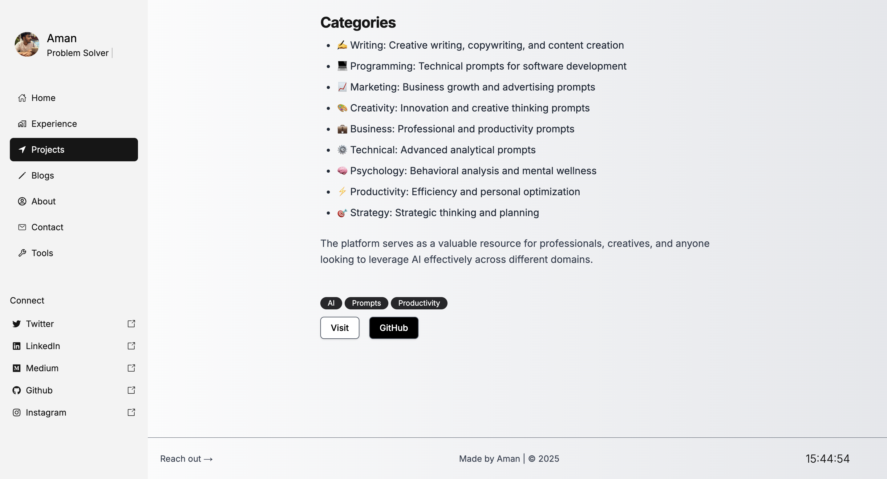
  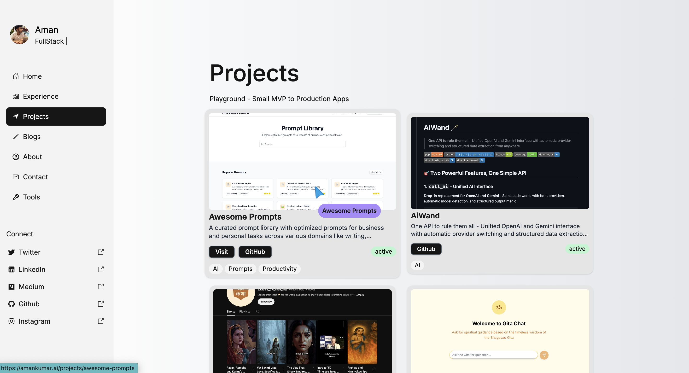
  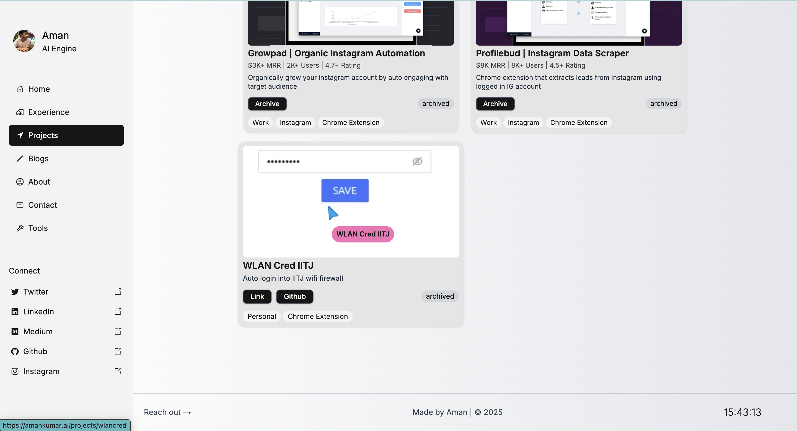
  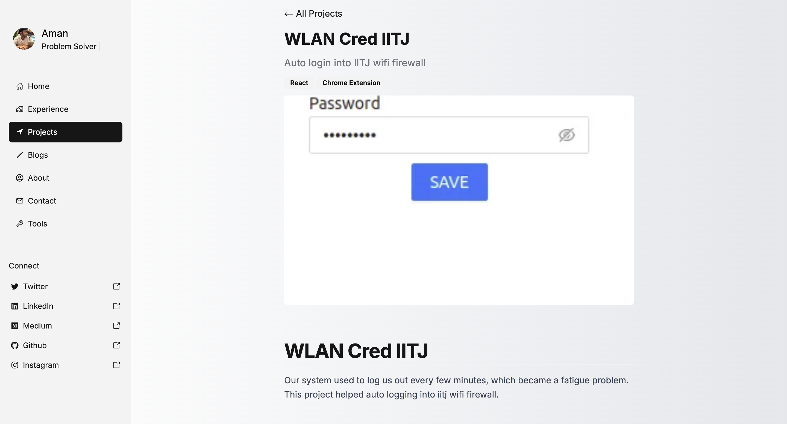
- Pour l’instant, tu peux **inventer** quelques projets ou reprendre ceux visibles sur les images.
- Crée **4 sous-pages** supplémentaires (une par projet) pour détailler chacun d’eux.
- Reste fidèle à la structure sans reproduire les animations complexes.

---

## 👤 Page À propos – `About.md`

Cette page contient une présentation personnelle, académique et plus humaine.

**Contenu à inclure :**
- Présentation : étudiant en M2 Recherche, passionné de ML, à la recherche d’un stage ou d’un PhD.
- Coordonnées : e-mail (trouvé dans le CV).
- Section personnelle : voyages, goûts littéraires (photos à venir).

**Instructions :**
- Inspires-toi des pages :
  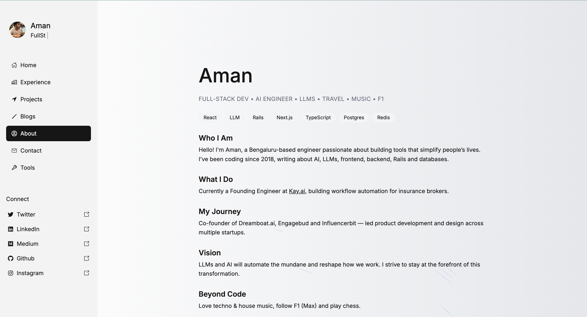
  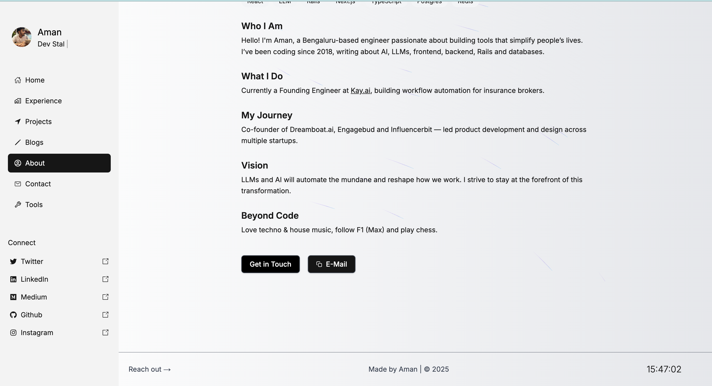
- Utilise les informations disponibles dans mon CV.
- Structure avant esthétique : reste simple pour l’instant.

---

## 📬 Page Contact – `Contact.md`

Cette page fait office de **carte de visite** : elle affiche mes coordonnées principales.

**Informations à inclure :**
- Numéro de téléphone
- Adresse e-mail
- Réseaux sociaux (LinkedIn, GitHub, etc.)

**Instructions :**
- Inspires-toi de cette image :
  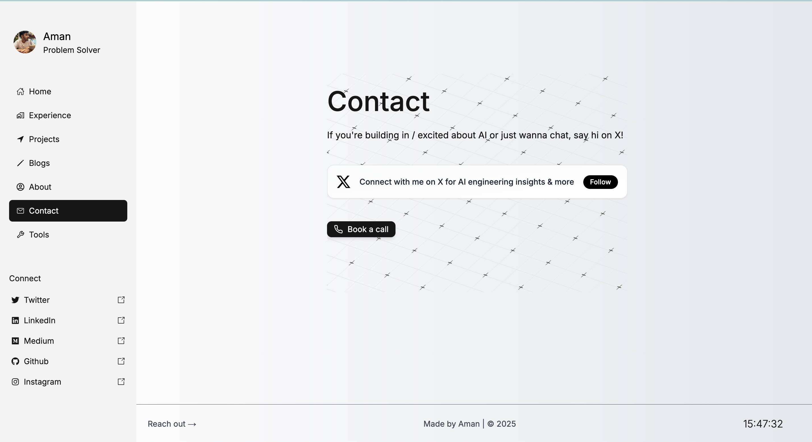
- Toutes les informations sont disponibles dans mon CV.
- Ne cherche pas à reproduire les effets visuels avancés.

---

N'hésite pas à me demander si tu veux aussi un modèle de fichier `.md` pour l'une des pages, un style CSS simple, ou un squelette de site avec MkDocs ou autre outil statique !
